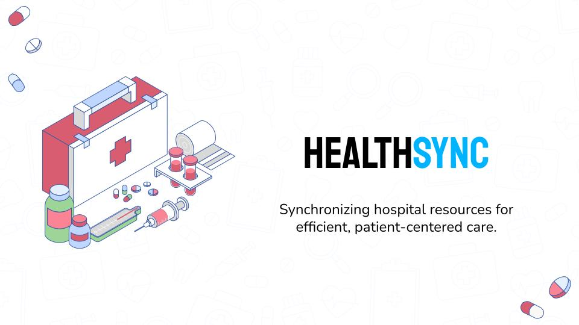

# HealthSync: Making hospitals more efficient one node at a time


**Table of Contents**

1. [HealthSync Frontend Installation Guide](#healthsync-frontend-installation-guide)
    * [Prerequisites for Frontend Installation](#prerequisites-for-frontend-installation)
    * [Installation Steps for Frontend](#installation-steps-for-frontend)
    * [Running the Development Server (Frontend)](#running-the-development-server-frontend)
2. [HealthSync Backend Installation Guide](#healthsync-backend-installation-guide)
    * [Prerequisites for Backend Installation](#prerequisites-for-backend-installation)
    * [Installation Steps for Backend](#installation-steps-for-backend)
    * [Running the Development Server (Backend)](#running-the-development-server-backend)
3. [API Endpoints](#api-endpoints) 
4. [Troubleshooting](#troubleshooting)


---

## HealthSync Frontend Installation Guide

This guide will help you install and run the frontend of the HealthSync project.

### Prerequisites for Frontend Installation

Before beginning, ensure you have the following installed on your machine:

* [Node.js](https://nodejs.org/) (v14 or higher)
* [Bun](https://bun.sh/) (a fast JavaScript runtime)

### Installation Steps for Frontend

1. **Clone the repository** (if you haven't already):

    ```sh
    git clone https://github.com/your-repo/HealthSync.git
    cd HealthSync/Frontend/HealthSync
    ```

2. **Install dependencies** using `bun`:

    ```sh
    bun install  
    ```

### Running the Development Server (Frontend)

To start the development server, run:

```bash
bun run vite
```

This will start the Vite development server, and you can view the application in your browser.

---

## HealthSync Backend Installation Guide

This guide will help you install and run the backend of the HealthSync project.

### Prerequisites for Backend Installation

Before beginning, ensure you have the following installed on your machine:

* [Python](https://www.python.org/) (v3.9 or higher)
* [FastAPI](https://fastapi.tiangolo.com/)

### Installation Steps for Backend

1. **Clone the repository** (if you haven't already):

    ```sh
    git clone https://github.com/your-repo/HealthSync.git
    cd HealthSync/Backend
    ```

2. **Install dependencies** using `pip`:

    ```bash
    pip install -r requirements.txt  
    ```

### Running the Development Server (Backend)

To start the development server, run:

```bash
python main.py
```

This will start the FastAPI server, and you can access the API at `http://localhost:8000`.

---

## API Endpoints

This section explains the available endpoints in the application.

### Health Check Endpoint

- **GET** `/`: Returns a simple message indicating the server is up.

### Hospital Resources Management

- **POST** `/counts/`: Update hospital resource counts by creating a JSON file containing resource data.
  - **Request Body**: `Counts` model
  - **Response**: Success

### Graph Patient Data Endpoint

- **GET** `/graph`: Returns graph data from the server in JSON format.

### Walk-in Patient Management

- **POST** `/walkin/`: Handles walk-in patients by creating a JSON file containing patient data.
  - **Request Body**: `Patient` model
  - **Response**: Status success

---

## Models

The application uses Pydantic models to validate and parse incoming requests.

### Patient Model

```python
class Patient(BaseModel):
    description: str
```

**Example**:

```json
{
  "description": "John Doe suffering from COVID-19"
}
```

### Counts Model

```python
class Counts(BaseModel):
    total_doctors: int
    available_doctors: int
    patients_being_treated: int
    patients_in_waiting_room: int
    beds_available: int
    total_equipment: int
```

**Example**:

```json
{
    "total_doctors": 5,
    "available_doctors": 3,
    "patients_being_treated": 10
}
```

---

## Troubleshooting

If you encounter any issues during installation or while running the development server, please refer to:

* [Bun documentation](https://bun.sh/)
* [FastAPI documentation](https://fastapi.tiangolo.com/)
* [Python official documentation](https://docs.python.org/3/)